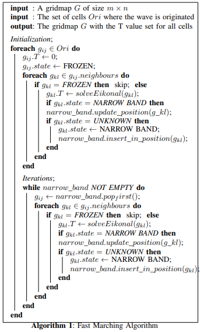

# Fast Marching Method Planner for TurtleBot3 Waffle Robot using ROS2 and Python3



## Table of Contents
- [Overview](#overview)
- [Features](#features)
- [Architecture](#architecture)
- [Installation](#installation)
  - [Prerequisites](#prerequisites)
  - [ROS2 Setup](#ros2-setup)
  - [Repository Setup](#repository-setup)
- [Usage](#usage)
  - [Launching the Planner](#launching-the-planner)
  - [Running the Simulation](#running-the-simulation)
- [Methodology](#methodology)
  - [Fast Marching Method](#fast-marching-method)
  - [Integration with TurtleBot3](#integration-with-turtlebot3)
- [Configuration](#configuration)
  - [Planner Parameters](#planner-parameters)
  - [Robot Configuration](#robot-configuration)
- [Visualization](#visualization)
- [Troubleshooting](#troubleshooting)
- [Contributing](#contributing)
- [License](#license)
- [Acknowledgements](#acknowledgements)

## Overview

This project implements the **Fast Marching Method (FMM)** for path planning on the **TurtleBot3 Waffle** robot using **ROS2** and **Python3**. The Fast Marching Method is an efficient algorithm for solving the Eikonal equation, which is essential for computing optimal paths in dynamic and complex environments. By integrating FMM with ROS2, this planner enables real-time, collision-free navigation for TurtleBot3 in simulated and real-world scenarios.

## Features

- **Efficient Path Planning**: Utilizes the Fast Marching Method for swift and optimal path computation.
- **ROS2 Integration**: Seamlessly integrates with ROS2 for communication and control.
- **Real-Time Navigation**: Supports real-time path updates and obstacle avoidance.
- **Visualization Tools**: Provides RViz integration for visualizing planned paths and robot movement.
- **Customizable Parameters**: Allows easy tuning of planner and robot parameters to suit various environments.
- **Simulation Support**: Compatible with Gazebo for simulating TurtleBot3 in diverse scenarios.

## Architecture

1. **Sensor Input**: TurtleBot3's sensors (e.g., LiDAR) provide real-time environmental data.
2. **Map Processing**: The environment is represented as an occupancy grid map.
3. **FMM Planner**: Processes the map to compute the optimal path using the Fast Marching Method.
4. **Path Execution**: The planned path is sent to the TurtleBot3 for navigation.
5. **Visualization**: Gazebo displays the robot, planned path, and environmental data for monitoring.

## Demo Video

To see the Fast Marching Method Planner in action, watch the following demo video:


## Installation

### Prerequisites

- **Operating System**: Ubuntu 22.04 LTS
- **ROS2 Distribution**: Humble Hawksbill
- **Python Version**: Python 3.8
- **TurtleBot3 Packages**: Ensure TurtleBot3 packages are installed.

### ROS2 Setup

1. **Install ROS2 humble**:

    Follow the official ROS2 Humble installation guide:
    [ROS2 Humble Installation](https://docs.ros.org/en/humble/Installation.html)

2. **Source ROS2 Setup Script**:

    ```bash
    source /opt/ros/humble/setup.bash
    ```

3. **Install TurtleBot3 Packages**:

    ```bash
    sudo apt update
    sudo apt install ros-humble-turtlebot3 ros-humble-turtlebot3-simulations
    ```

4. **Set TurtleBot3 Model**:

    Add the following line to your `.bashrc` to set the TurtleBot3 model to Waffle:

    ```bash
    echo "export TURTLEBOT3_MODEL=waffle" >> ~/.bashrc
    source ~/.bashrc
    ```

### Repository Setup

1. **Clone the Repository**:

    ```bash
    cd ~/ros2_ws/src
    git clone https://github.com/MayankD409/Fast-Marching-Method.git
    ```

2. **Install Dependencies**:

    Navigate to your ROS2 workspace and install any additional dependencies.

    ```bash
    cd ~/ros2_ws/
    rosdep install --from-paths src --ignore-src -r -y
    ```

3. **Build the Workspace**:

    ```bash
    cd ~/ros2_ws/
    colcon build --symlink-install
    ```

4. **Source the Workspace**:

    ```bash
    source ~/ros2_ws/install/setup.bash
    ```

## Usage

### Launching the Planner

1. **Source ROS2**:

    Open a new terminal and run:

    ```bash
    source /opt/ros/humble/setup.bash
    ```

2. **Launch TurtleBot3 in Simulation**:

    In same terminal, launch the TurtleBot3 in Gazebo:

    ```bash
    source ~/ros2_ws/install/setup.bash
    ros2 launch fast_marching_method competition_world.launch.py
    ```

3. **Launch the Fast Marching Planner**:

    In a third terminal, run the planner node:

    ```bash
    source ~/ros2_ws/install/setup.bash
    ros2 run fast_marching_method fmm_planner.py
    ```

### Running the Simulation

1. **Move the Robot**:

    Use teleoperation to move the TurtleBot3 and observe the planner in action.

    ```bash
    source ~/ros2_ws/install/setup.bash
    ros2 run turtlebot3_teleop teleop_keyboard
    ```

2. **Visualize in RViz**:

    Open RViz to visualize the planned path and robot movement.

    ```bash
    source ~/ros2_ws/install/setup.bash
    ros2 run rviz2 rviz2
    ```

    - **Add Topics**:
        - `/map`: Occupancy grid map.
        - `/planned_path`: Marker for the planned path.
        - `/cmd_vel`: Velocity commands for the robot.

## Methodology

### Fast Marching Method

The Fast Marching Method (FMM) is an efficient algorithm for solving the Eikonal equation, which models the propagation of fronts. In the context of path planning, FMM computes the arrival time of a front from a start point to all reachable points in the environment. The optimal path is then derived by backtracking from the goal to the start based on the computed arrival times.

**Key Steps in FMM Planner:**

1. **Initialization**: Set the start point with an arrival time of zero and initialize all other points with infinity.
2. **Front Propagation**: Iteratively update the arrival times of neighboring points based on their distance from the front.
3. **Path Extraction**: Backtrack from the goal point to the start by following the gradient of arrival times.

### Integration with TurtleBot3

The FMM planner is integrated with TurtleBot3 through ROS2 nodes. The planner subscribes to sensor data to build the occupancy grid map and publishes velocity commands to navigate the robot along the planned path. Real-time updates ensure that the robot can adapt to dynamic obstacles and changing environments.

## Configuration

### Planner Parameters

Parameters for the Fast Marching Method planner can be adjusted to optimize performance and behavior.

- **Planner Rate**: Frequency at which the planner updates the path.
- **Goal Point**: Coordinates of the desired destination.
- **Obstacle Inflation**: Padding around obstacles to ensure safe navigation.
- **Grid Resolution**: Resolution of the occupancy grid map.

These parameters can be configured in the launch files or via ROS2 parameters.

### Robot Configuration

Ensure that the TurtleBot3 model is correctly set to Waffle by verifying the `TURTLEBOT3_MODEL` environment variable.

```bash
echo $TURTLEBOT3_MODEL
# Output should be 'waffle'
